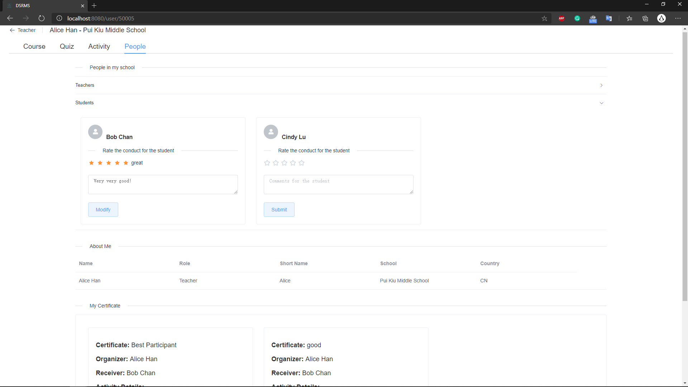

# Distributed Students Record Management System

City University of Hong Kong  
Department of Computer Science  
Final Year Project 19CS005

## Project Structure

### Prerequisites

* Java 8 JDK - At least version 8u171, but do not support Java 9 or higher version
* Nodejs
* Modern web browser - Vuejs does not support IE8 and below, because it uses ECMAScript 5 features that are un-shimmable in IE8.

### Backend

* Write CorDapp base on [Corda](https://docs.corda.net/)
* Programming Language: Kotlin
* Webserver: Spring Boot

### Frontend

* [Vuejs](https://vuejs.org/v2/guide/index.html) + [Element](https://element.eleme.io/#/en-US)

## Run this project

### Run the backend first (must)

1. Open terminal in the current directry
2. Get into the backend folder: `cd ./DSEMS-Corda-Backend`

3. Follow this [instruction](https://github.com/BigtoC/Distributed-Students-Record-Management-System/blob/master/DSRMS-Corda-Backend/README.md) to run the backend system.

### Then, run the frontend website

1. Open a new terminal and get into the frontend directory
2. Follow this [instruction](https://github.com/BigtoC/Distributed-Students-Record-Management-System/blob/master/dsrms-vue-frontend/README.md) to run the frontend.
3. Copy the URL printed in the terminal to your browser (normally is <http://localhost:8080/>)
